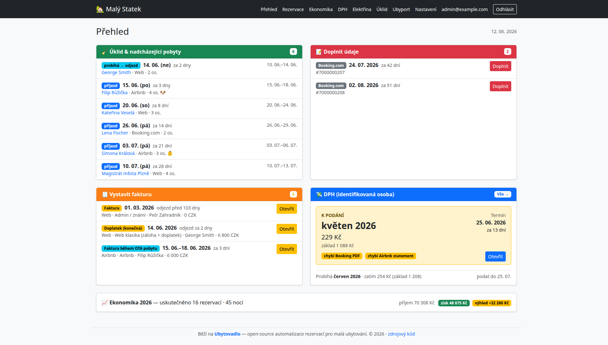

# Ubytovadlo

**Chytrá automatizace rezervací pro malé ubytovatele.** Ubytovadlo sleduje rezervace z webu, Bookingu i Airbnb a samo z nich vystaví fakturu, založí řádek v evidenci a pohlídá hlášení i lhůty. Vy zadáte rezervaci jednou — **o zbytek se postará samo**. Bez drahých zahraničních předplatných.



## Proč vzniklo

S manželkou máme na statku ve Lništi u Trhových Svinů **Vejminek Malý Statek** — starou kamennou chalupu, kterou jsme zrekonstruovali a dnes ji pronajímáme (čtyři lůžka, psi vítáni). Hosté si u nás rezervují pobyt přes náš vlastní web, Booking, Airbnb i české eChalupy a CS chalupy, někdo platí hotově či převodem, jiný FKSP poukazem.

A v tom je ten háček: každý kanál si žije po svém. Přišla rezervace — a začal kolotoč. Opsat hosta z Bookingu do evidence, tytéž údaje pak ještě jednou do faktury, dopočítat kurz, nezapomenout na zálohu, na DPH z provize, na hlášení cizinců. Pak totéž z Airbnb, z webu, z eChalup. Pořád dokola a s nepříjemným pocitem, že se na něco zase zapomnělo.

Tak jsem si řekl, že to musí jít líp, a o víkendech se do toho pustil ([Vojtěch Žoha](https://www.linkedin.com/in/vojtech-zoha/)) — nejdřív jako koníček, který ale přerostl v tento projekt. Dneska rezervaci zadáme jednou a o zbytek — fakturu, evidenci, hlášení i připomínky — se postará Ubytovadlo samo. **Není to demo, běží nám to naostro.** A protože je psané obecně, může posloužit i vám.

## Co umí

- **Přehled, který myslí za vás** — úvodní dashboard řekne, co opravdu řešit: kdo přijíždí, kde uklidit, komu vystavit fakturu, na jakou lhůtu nezapomenout. Žádné hledání po složkách a tabulkách, žádné „na něco jsem zapomněl" — barvy samy upozorní na to, co hoří.
- **Pracuje, i když vy ne** — nová rezervace z webu, e‑mail od Bookingu, blok v Airbnb kalendáři: systém je zachytí sám a založí, co má. Vy se ráno jen podíváte, co přibylo — místo neustálého přepisování.
- **Rezervace ze všech kanálů na jednom místě** — vlastní web, Booking i Airbnb se slévají do jednoho přehledu. U webových rezervací nezadáváte nic, u Booking a Airbnb doplníte jen to, co chybí.
- **Faktury na několik kliknutí** — úhledné PDF s QR platbou, navazující číselnou řadou a automatickým přepočtem z eur na koruny kurzem ČNB. Systém sám pozná, jaký typ faktury vystavit (záloha, FKSP, Airbnb, Booking…).
- **DPH z provizí pod kontrolou** — pro identifikované osoby (§6h ZDPH): daň z provizí Booking/Airbnb se spočítá sama a měsíčně připraví podklad pro účetní. Žádné opomenutí, žádný problém s finančním úřadem.
- **Přehled příjmů a výdajů** — zisk na každou rezervaci (po odečtu elektřiny, úklidu, poplatků, provizí a DPH) na jednom dashboardu místo roztroušených tabulek.
- **Online check‑in i pro cizince** — čeští hosté projdou bez vyplňování, u cizinců systém sebere doklady pro povinné hlášení (Ubyport) včetně naskenování pasu kamerou. Firemní údaje načte z IČO.

## Pro koho je

Pro malé ubytovatele — apartmán nebo chalupu — kteří prodávají přes více kanálů a nechtějí platit drahé zahraniční systémy ani trávit večery přepisováním dat. Zatím cílí na jednu ubytovací jednotku (podpora více jednotek je v plánu). Sedí hlavně českým provozovatelům: řeší **Ubyport, identifikovanou osobu, DPH z OTA provizí, QR Platbu i kurzy ČNB** — věci, které zahraniční channel managery neumí.

## Stack

PHP 8 / Symfony 7 · Doctrine ORM · MySQL/MariaDB · Twig + Bootstrap · mPDF · `webklex/php-imap`. Cron místo daemonů (cílí na sdílený hosting).

## Rozjetí (lokálně, Docker)

```bash
docker compose up -d                                                 # app na http://localhost:8000
docker compose exec app bin/console doctrine:migrations:migrate      # schéma
docker compose exec app bin/console app:dev:import-fixtures          # demo data
docker compose exec app vendor/bin/phpunit                           # testy
```

Konfigurace: zkopírujte potřebné řádky z [`app/.env.example`](app/.env.example) do `app/.env.local` (necommitovaný) a vyplňte — tajemství a fakturační údaje patří **jen sem**, nikdy do committovaných `.env*`.

Uživatele pro přihlášení založíte přes `bin/console app:user:create`.

## Produkce

Žádný drahý server ani VPS — Ubytovadlo běží na **běžném sdíleném PHP/MySQL hostingu** (stačí podpora IMAP a cronu). Žádné daemon procesy: úlohy (IMAP poller, MotoPress sync) se spouští z cronu. Detaily v [`docs/deploy.md`](docs/deploy.md). Všechny změny schématu **výhradně přes Doctrine migrace**.

## Chci to používat

- **Provozuji ubytování a chci to nasadit** — kód je open source, nasadíte si ho sami (viz výše). Nechcete se tím zabývat? Nabízím **nasazení na klíč a úpravy na míru** (další kanály, vlastní fakturační toky, napojení na účetnictví). Ozvěte se na <vzoha@volny.cz>.
- **Chci to bez starostí jako službu** — chystám **freemium SaaS** verzi (hostované Ubytovadlo, nulová údržba). Pořadník zájemců časem na [ubytovadlo.cz](https://ubytovadlo.cz).

## Licence

[Functional Source License 1.1 (ALv2 Future License)](LICENSE.md) © 2026 Vojtěch Žoha. FSL umožňuje použití, úpravy i interní/komerční nasazení pro vlastní provoz; **zakazuje jen konkurenční komerční nabídku** (tj. provozovat z tohoto kódu konkurenční hostovanou službu). Po dvou letech každá verze přechází na Apache 2.0.
